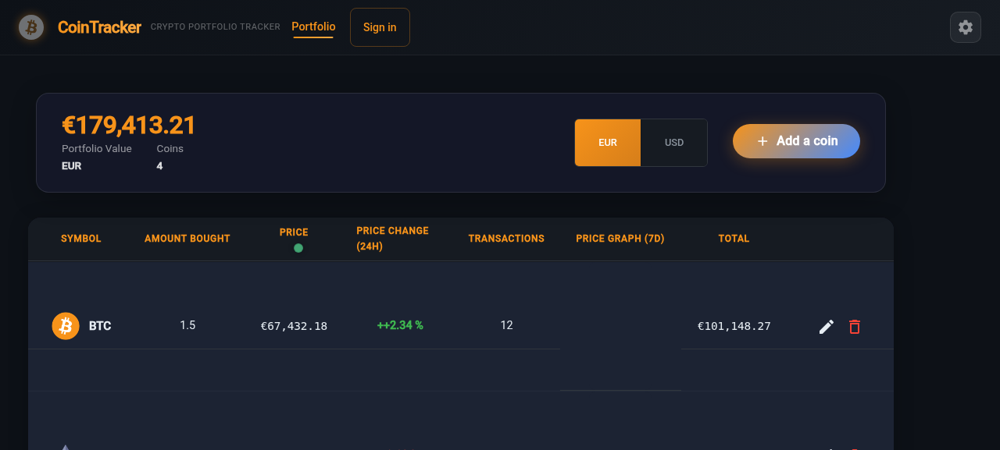
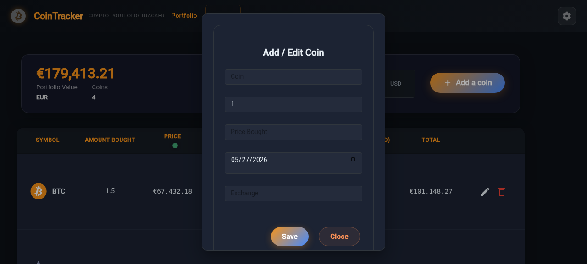
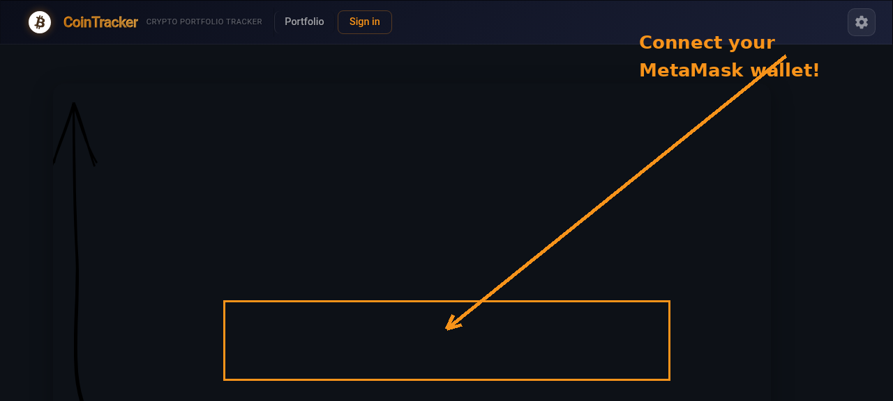
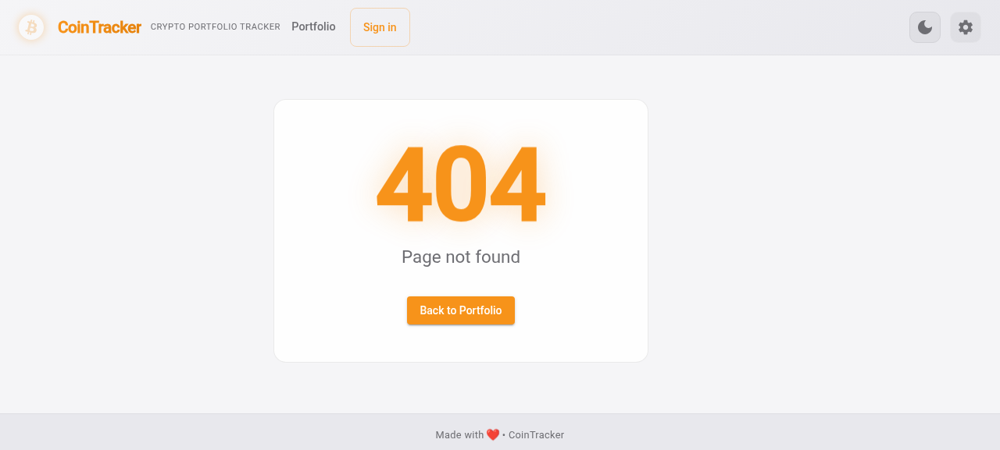

# CoinTracker 🪙

**Cryptocurrency Portfolio Tracker** — Track, analyze, and manage your crypto holdings.

[](https://angular.io)
[](https://firebase.google.com)
[](LICENSE)

---

## ✨ Features

- 🔐 **Login with Google or MetaMask** — Firebase Auth + Ethereum wallet sign-in
- 📊 **Live portfolio balance** — Real-time prices via CoinGecko API
- 🖼️ **Coin images** — Auto-fetched from CoinGecko with caching
- 📈 **7-day price graphs** — Mini sparklines + full detail charts
- 🔄 **24h price change** — Color-coded with live indicators
- 🔍 **Search & filter** — Filter transactions by exchange
- 📱 **Fully responsive** — Mobile-first design with adaptive columns
- 🌙 **Dark crypto theme** — Bitcoin orange accent, glassmorphism effects
- 🎉 **Confetti delight** — Celebration animation on portfolio load
- 📄 **Paginated table** — Sortable, with configurable page sizes

## 🚀 Live Demo

[https://cointracker-26919.web.app](https://cointracker-26919.web.app)

## 📸 Screenshots

### Portfolio Dashboard


*Live portfolio with sortable table, CoinGecko prices, 24h change indicators, 7-day sparkline graphs, and paginator*

### Add Coin Dialog


*Add coins with symbol auto-complete, amount, price, date picker, and exchange fields*

### Login Page


*Clean glassmorphism card with Google Sign-In and MetaMask Connect Wallet buttons*

### 404 Page


*Dark-themed 404 with floating animation and Bitcoin orange accent*

## 🛠️ Tech Stack

| Layer | Technology |
|-------|-----------|
| **Frontend** | Angular 9, Angular Material, Chart.js |
| **Backend** | Firebase (Firestore, Auth, Hosting) |
| **API** | CoinGecko (prices, images, market data) |
| **Auth** | Google Sign-In, MetaMask Wallet |
| **Styling** | CSS Custom Properties, Glassmorphism, Bootstrap |
| **Build** | Node 16, Angular CLI 9 |

## 📋 README Checklist

| # | Feature | Status |
|---|---------|--------|
| 1 | Center content | ✅ |
| 2 | Responsive design | ✅ |
| 3 | Use Async pipe (price change) | ✅ |
| 4 | Add paginator | ✅ |
| 5 | Change coins API (coins + images) | ✅ CoinGecko |
| 6 | Adjust layout "details" page | ✅ |
| 7 | Change favicon | ✅ Bitcoin ₿ |
| 8 | Add login with wallet | ✅ MetaMask |
| 9 | Add search for exchanges | ✅ |
| 10 | Add loading animation graph | ✅ |
| 11 | Decentralized | ⏭️ Skipped |
| 12 | Add delight 🎉 | ✅ Confetti |

## 🏗️ Development

### Prerequisites
- Node.js 16.x
- Angular CLI 9.x
- Firebase account

### Setup

```bash
# Clone the repo
git clone https://github.com/QuintusTheFifth/CoinTracker.git
cd CoinTracker

# Install dependencies
npm install --legacy-peer-deps

# Run dev server
ng serve --proxy-config proxy.conf.json

# Build for production
ng build --prod
```

### Deploy to Firebase

```bash
# Local deploy (requires firebase login)
./deploy.sh

# Or use GitHub Actions (set FIREBASE_TOKEN or FIREBASE_SERVICE_ACCOUNT secret)
```

### CI/CD

The repo includes a GitHub Actions workflow (`.github/workflows/firebase-deploy.yml`) that:
1. Installs deps with `npm install --legacy-peer-deps`
2. Builds with `ng build --prod`
3. Deploys to Firebase Hosting

To enable, add one of these secrets to the repo:
- `FIREBASE_TOKEN` — from `firebase login:ci`
- `FIREBASE_SERVICE_ACCOUNT` — service account JSON key (recommended)

---

*Built with ❤️ using Angular & Firebase*
