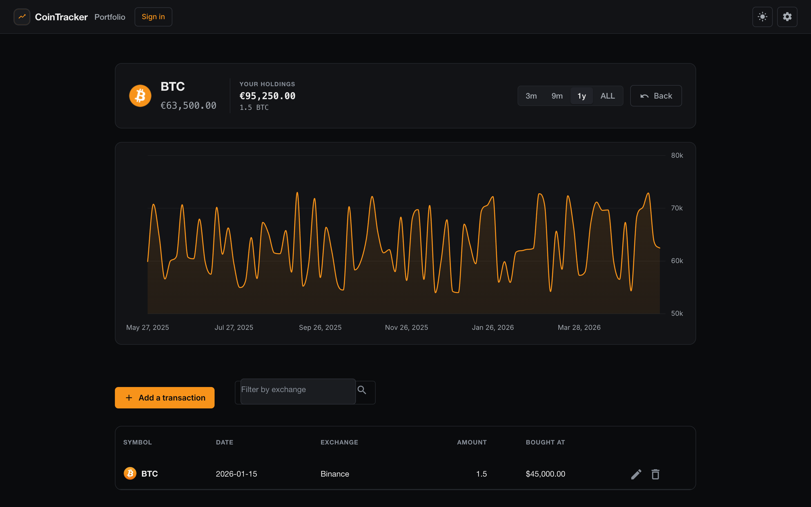

# CoinTracker

A polished Angular + Firebase cryptocurrency portfolio tracker for monitoring holdings, transactions, live market prices, and historical performance.

[](https://angular.io)
[](https://firebase.google.com)
[](https://www.chartjs.org/)
[](LICENSE)

## Overview

CoinTracker helps crypto investors keep a clean view of their portfolio:

- Track multiple coins and transactions across exchanges.
- View live prices, portfolio value, and 24-hour market moves.
- Drill into a coin for historical charts and transaction history.
- Sign in with Google or connect an Ethereum wallet.
- Use demo mode when authentication is unavailable.

Live app: [cointracker-26919.web.app](https://cointracker-26919.web.app)

## Features

- **Portfolio dashboard:** sortable holdings table, paginated rows, totals, live price indicators, and 7-day mini charts.
- **Coin detail pages:** large historical price chart, range controls, transaction table, and exchange filtering.
- **Transaction management:** add, edit, and delete coin transactions from modal dialogs.
- **Market data:** CoinGecko prices, coin IDs, images, 24-hour change, and chart history.
- **Resilient fallback mode:** top-coin static data keeps the UI usable if market APIs are unavailable.
- **Authentication:** Google Sign-In via Firebase Auth and MetaMask wallet sign-in.
- **Demo mode:** localStorage-backed portfolio for quick unauthenticated exploration.
- **Responsive UI:** dark crypto-themed interface optimized for desktop and mobile.
- **Production hardening:** deterministic install settings, headless test support, lint gate, production build script, and critical production audit gate.

## Screenshots

### Portfolio dashboard


Live portfolio summary with tracked coins, price updates, 24-hour change indicators, mini charts, sorting, and pagination.

### Coin detail view



Detailed coin page with historical chart ranges, exchange filtering, and transaction actions.

### Add transaction dialog


Form dialog with coin symbol autocomplete, amount, bought price, date picker, and exchange fields.

### Login page


Google Sign-In, MetaMask wallet login, and demo access.

### 404 page


Dark themed fallback page with navigation back to the portfolio.

## Tech stack

- **Frontend:** Angular 9, Angular Material, Angular Flex Layout
- **Charts:** Chart.js 2.9
- **Backend:** Firebase Auth, Firestore, Realtime Database rules, Firebase Hosting
- **Market data:** CoinGecko REST API
- **Styling:** CSS custom properties, responsive layouts, dark theme
- **Testing:** Karma, Jasmine, Puppeteer Chrome Headless
- **Tooling:** Angular CLI, TSLint, Firebase CLI

## Getting started

### Prerequisites

- Node.js 16+ or a newer Node version compatible with `NODE_OPTIONS=--openssl-legacy-provider`.
- npm.
- Firebase project if you want hosted auth/storage behavior.

The repo includes `.npmrc` with `legacy-peer-deps=true` because this is an Angular 9 application with older peer dependency ranges.

### Install

```bash
git clone https://github.com/QuintusTheFifth/CoinTracker.git
cd CoinTracker
npm install
```

### Run locally

```bash
npm start
```

The app starts through Angular CLI with the legacy OpenSSL provider configured in `package.json`.

### Production build

```bash
npm run build:prod
```

Build output is written to:

```text
dist/coinTracker
```

Firebase Hosting is configured to serve that directory.

## Quality checks

Run the full local gate before deploying or merging:

```bash
npm run verify
```

Expected status:

- Lint passes with no reported files.
- Production build completes.
- Karma/Jasmine runs in headless Chrome.
- Critical production audit gate exits successfully.
- Firestore rules restrict portfolio data to `/users/{uid}` and `/users/{uid}/coins` for the authenticated owner only.
- `npm run verify` includes a Firestore rules assertion script (`npm run verify:rules`) so owner-scoping regressions fail CI.

Note: the Angular 9/Firebase 7 dependency line may still report high or moderate advisories that require a breaking framework migration. Critical production advisories are blocked by `npm run audit:critical`; see [SECURITY.md](SECURITY.md) for the migration policy.

## Firebase deployment

### Local deploy

```bash
./deploy.sh
```

### GitHub Actions

The workflow in `.github/workflows/firebase-deploy.yml` installs dependencies, builds the production bundle, and deploys to Firebase Hosting.

Configure one of these repository secrets:

- `FIREBASE_SERVICE_ACCOUNT` — recommended service account JSON.
- `FIREBASE_TOKEN` — token from `firebase login:ci`.

## Project structure

```text
src/app/authentication/      Firebase and wallet auth
src/app/coins/               Portfolio, detail, chart, dialog, and data services
src/app/user/login/          Login and demo entry UI
src/app/page-not-found/      404 route
scripts/                     Compatibility patches used after install
.github/workflows/           Firebase deployment workflow
```

## Notes for maintainers

- CoinGecko has duplicate symbols. The service preserves canonical mappings for common assets so symbols like BTC and ETH resolve predictably.
- Demo mode stores data locally and is intentionally separate from authenticated Firestore data.
- Wallet sessions are in-memory and require a fresh signature rather than trusting persisted wallet IDs.
- The app displays when it is using estimated fallback prices instead of live CoinGecko responses.

## License

MIT
